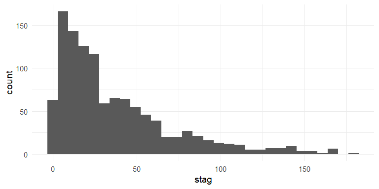
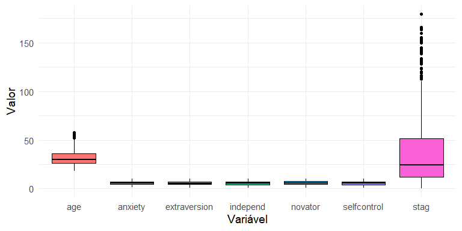
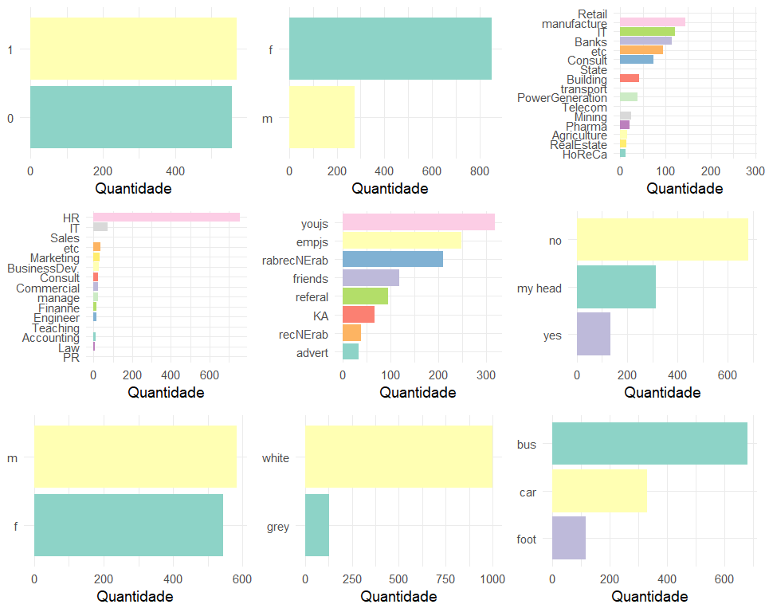
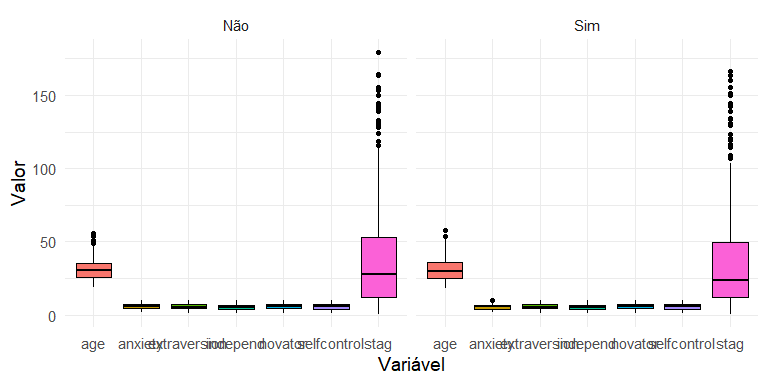
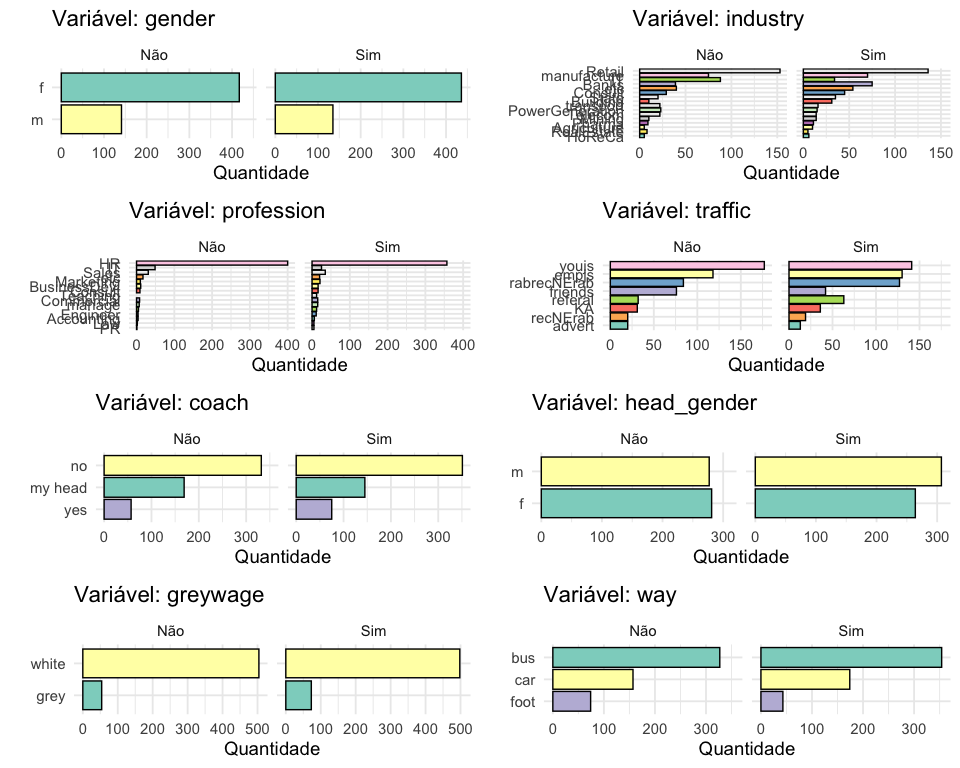

TurnOver v2
================
**Autores:** Rodrigo Almeida & Rafael Barbosa | **Data:**
06/04/2020


## 1\. Introdução ao TurnOver

O Tunover é nada mais do que a taxa de rotatividade dos funcionários de
uma empresa. Mede o percentual de desligamento em um determinado período
de tempo, geralmente fechado em períodos anuais. Este tipo de análise
não mede só e unicamente o número bruto de desligamentos, e sim traz o
intuito de explorar a fundo quais os fatores que influenciam neste
processo.

Através de variáveis operacionais e indicadores da empresa, utilizam-se
diversas ferramentas que vão desde análises estatísticas até técnicas de
Machine Learning. Tudo isso engrandece a análise e traz mais
credibilidade para se falar deste assunto.

Além de tudo isso, deve-se deixar claro alguns pontos relevantes para
quem trabalha ou deseja trabalhar nesta vertente. Primeiro que o contato
com outras áreas é fundamental para deixar a análise robusta e alinhada
com o negócio que demanda a resolução: provável falar com gerentes,
diretores, área de RH ou os Business Partiner dos setores da empresa.
Segundo que esta vertente requer muita responsabilidade e princípio de
confidencialidade, pois lida com informações completamente sensível,
como salário, risco de desligamento por gestor, dentre outras.

Por fim, o Turnover já traz resultados expressivos atualmente. Diversas
empresas enriqueceram as informações sobre seus colaboradores a fim de
analisá-las e exeutarem ações para fazer acontecer uma coisa que, mesmo
que óbvia, não era muito prticada: funcionário feliz traz bons
resultados\!

## 2\. Entendimento do problema

  - **stag**: experiência (em anos ou meses)

  - **event**: demitido ou não

  - **gender**: gênero

  - **age**: idade

  - **industry**: tipo de indústria

  - **profession**: setor em que trabalha

  - **traffic**: meio em que o candidato se candidatou

  - **coach**: presença de um **buddy**

  - **head\_gender**: gênero do seu **buddy**

  - **greywage**: algo relacionado com taxas para o governo

  - **way**: meio de transporte para o trabalho

  - **extraversion**, **independ**, **selfcontrol**, **anxiety**,
    **novator**: Escala de teste Big5

  - Escrever algo sobre o problema atual

## 3\. R e Rstudio

<p align="center">


<br> <em> <span>Disponível
<a href="https://bcrf.biochem.wisc.edu/all-tutorials/tutorial-materials-r-rstudio/">aqui</a></span>
</em>

</p>

  - Escrever algo aqui sobre o R e o Rstudio

### 3.1. Pacotes utilizados

``` r
require(tidyverse)
require(kableExtra)
```

### 3.2. Importação dos dados

  - Escrever algo?

<!-- end list -->

``` r
dados <- read.csv(file = "data/turnover-data-set.csv")

dados %>% 
  head %>% 
  kbl %>% 
  kable_classic(full_width = T, html_font = "Arial") %>% 
  kable_styling(bootstrap_options = c("striped", "hover", "condensed", "responsive", position = "center"))
```

<table class=" lightable-classic table table-striped table-hover table-condensed table-responsive" style="font-family: Arial; margin-left: auto; margin-right: auto; margin-left: auto; margin-right: auto;">

<thead>

<tr>

<th style="text-align:right;">

stag

</th>

<th style="text-align:right;">

event

</th>

<th style="text-align:left;">

gender

</th>

<th style="text-align:right;">

age

</th>

<th style="text-align:left;">

industry

</th>

<th style="text-align:left;">

profession

</th>

<th style="text-align:left;">

traffic

</th>

<th style="text-align:left;">

coach

</th>

<th style="text-align:left;">

head\_gender

</th>

<th style="text-align:left;">

greywage

</th>

<th style="text-align:left;">

way

</th>

<th style="text-align:right;">

extraversion

</th>

<th style="text-align:right;">

independ

</th>

<th style="text-align:right;">

selfcontrol

</th>

<th style="text-align:right;">

anxiety

</th>

<th style="text-align:right;">

novator

</th>

</tr>

</thead>

<tbody>

<tr>

<td style="text-align:right;">

7.030801

</td>

<td style="text-align:right;">

1

</td>

<td style="text-align:left;">

m

</td>

<td style="text-align:right;">

35

</td>

<td style="text-align:left;">

Banks

</td>

<td style="text-align:left;">

HR

</td>

<td style="text-align:left;">

rabrecNErab

</td>

<td style="text-align:left;">

no

</td>

<td style="text-align:left;">

f

</td>

<td style="text-align:left;">

white

</td>

<td style="text-align:left;">

bus

</td>

<td style="text-align:right;">

6.2

</td>

<td style="text-align:right;">

4.1

</td>

<td style="text-align:right;">

5.7

</td>

<td style="text-align:right;">

7.1

</td>

<td style="text-align:right;">

8.3

</td>

</tr>

<tr>

<td style="text-align:right;">

22.965092

</td>

<td style="text-align:right;">

1

</td>

<td style="text-align:left;">

m

</td>

<td style="text-align:right;">

33

</td>

<td style="text-align:left;">

Banks

</td>

<td style="text-align:left;">

HR

</td>

<td style="text-align:left;">

empjs

</td>

<td style="text-align:left;">

no

</td>

<td style="text-align:left;">

m

</td>

<td style="text-align:left;">

white

</td>

<td style="text-align:left;">

bus

</td>

<td style="text-align:right;">

6.2

</td>

<td style="text-align:right;">

4.1

</td>

<td style="text-align:right;">

5.7

</td>

<td style="text-align:right;">

7.1

</td>

<td style="text-align:right;">

8.3

</td>

</tr>

<tr>

<td style="text-align:right;">

15.934292

</td>

<td style="text-align:right;">

1

</td>

<td style="text-align:left;">

f

</td>

<td style="text-align:right;">

35

</td>

<td style="text-align:left;">

PowerGeneration

</td>

<td style="text-align:left;">

HR

</td>

<td style="text-align:left;">

rabrecNErab

</td>

<td style="text-align:left;">

no

</td>

<td style="text-align:left;">

m

</td>

<td style="text-align:left;">

white

</td>

<td style="text-align:left;">

bus

</td>

<td style="text-align:right;">

6.2

</td>

<td style="text-align:right;">

6.2

</td>

<td style="text-align:right;">

2.6

</td>

<td style="text-align:right;">

4.8

</td>

<td style="text-align:right;">

8.3

</td>

</tr>

<tr>

<td style="text-align:right;">

15.934292

</td>

<td style="text-align:right;">

1

</td>

<td style="text-align:left;">

f

</td>

<td style="text-align:right;">

35

</td>

<td style="text-align:left;">

PowerGeneration

</td>

<td style="text-align:left;">

HR

</td>

<td style="text-align:left;">

rabrecNErab

</td>

<td style="text-align:left;">

no

</td>

<td style="text-align:left;">

m

</td>

<td style="text-align:left;">

white

</td>

<td style="text-align:left;">

bus

</td>

<td style="text-align:right;">

5.4

</td>

<td style="text-align:right;">

7.6

</td>

<td style="text-align:right;">

4.9

</td>

<td style="text-align:right;">

2.5

</td>

<td style="text-align:right;">

6.7

</td>

</tr>

<tr>

<td style="text-align:right;">

8.410678

</td>

<td style="text-align:right;">

1

</td>

<td style="text-align:left;">

m

</td>

<td style="text-align:right;">

32

</td>

<td style="text-align:left;">

Retail

</td>

<td style="text-align:left;">

Commercial

</td>

<td style="text-align:left;">

youjs

</td>

<td style="text-align:left;">

yes

</td>

<td style="text-align:left;">

f

</td>

<td style="text-align:left;">

white

</td>

<td style="text-align:left;">

bus

</td>

<td style="text-align:right;">

3.0

</td>

<td style="text-align:right;">

4.1

</td>

<td style="text-align:right;">

8.0

</td>

<td style="text-align:right;">

7.1

</td>

<td style="text-align:right;">

3.7

</td>

</tr>

<tr>

<td style="text-align:right;">

8.969199

</td>

<td style="text-align:right;">

1

</td>

<td style="text-align:left;">

f

</td>

<td style="text-align:right;">

42

</td>

<td style="text-align:left;">

manufacture

</td>

<td style="text-align:left;">

HR

</td>

<td style="text-align:left;">

empjs

</td>

<td style="text-align:left;">

yes

</td>

<td style="text-align:left;">

m

</td>

<td style="text-align:left;">

white

</td>

<td style="text-align:left;">

bus

</td>

<td style="text-align:right;">

6.2

</td>

<td style="text-align:right;">

6.2

</td>

<td style="text-align:right;">

4.1

</td>

<td style="text-align:right;">

5.6

</td>

<td style="text-align:right;">

6.7

</td>

</tr>

</tbody>

</table>

## 4\. Base de dados (estrutura)

<p align="center">


<br> <em> <span>Foto por
<a href="https://unsplash.com/@marcobias?utm_source=unsplash&amp;utm_medium=referral&amp;utm_content=creditCopyText">Marco
Biasibetti</a> em
<a href="https://unsplash.com/s/photos/explorator?utm_source=unsplash&amp;utm_medium=referral&amp;utm_content=creditCopyText">Unsplash</a></span>
</em>

</p>

``` r
dados %>% 
  glimpse
```

    ## Rows: 1,129
    ## Columns: 16
    ## $ stag         <dbl> 7.030801, 22.965092, 15.934292, 15.934292, 8.410678, 8.9…
    ## $ event        <int> 1, 1, 1, 1, 1, 1, 1, 1, 1, 1, 1, 1, 1, 1, 1, 1, 1, 1, 1,…
    ## $ gender       <chr> "m", "m", "f", "f", "m", "f", "f", "f", "f", "f", "f", "…
    ## $ age          <dbl> 35, 33, 35, 35, 32, 42, 42, 28, 29, 30, 40, 23, 22, 24, …
    ## $ industry     <chr> "Banks", "Banks", "PowerGeneration", "PowerGeneration", …
    ## $ profession   <chr> "HR", "HR", "HR", "HR", "Commercial", "HR", "HR", "HR", …
    ## $ traffic      <chr> "rabrecNErab", "empjs", "rabrecNErab", "rabrecNErab", "y…
    ## $ coach        <chr> "no", "no", "no", "no", "yes", "yes", "yes", "no", "no",…
    ## $ head_gender  <chr> "f", "m", "m", "m", "f", "m", "m", "m", "f", "m", "m", "…
    ## $ greywage     <chr> "white", "white", "white", "white", "white", "white", "w…
    ## $ way          <chr> "bus", "bus", "bus", "bus", "bus", "bus", "bus", "bus", …
    ## $ extraversion <dbl> 6.2, 6.2, 6.2, 5.4, 3.0, 6.2, 6.2, 3.8, 8.6, 5.4, 8.6, 3…
    ## $ independ     <dbl> 4.1, 4.1, 6.2, 7.6, 4.1, 6.2, 6.2, 5.5, 6.9, 5.5, 4.1, 6…
    ## $ selfcontrol  <dbl> 5.7, 5.7, 2.6, 4.9, 8.0, 4.1, 4.1, 8.0, 2.6, 3.3, 1.8, 4…
    ## $ anxiety      <dbl> 7.1, 7.1, 4.8, 2.5, 7.1, 5.6, 5.6, 4.0, 4.0, 7.9, 7.1, 4…
    ## $ novator      <dbl> 8.3, 8.3, 8.3, 6.7, 3.7, 6.7, 6.7, 4.4, 7.5, 8.3, 6.7, 7…

## 5\. EDA

### 5.1. Proporção da variável `Event`

``` r
dados %>% 
  count(event) %>% 
  mutate(event = case_when(event == 0 ~ "Não",
                           TRUE ~ "Sim"),
         perc = n/sum(n)*100) %>% 
  ggplot(data = ., aes(x = event, y = perc, fill = event)) +
  geom_bar(stat = "identity", colour = "black") +
  geom_text(aes(label = formato_real_graf(round(perc, 2))), vjust = -0.9, size = 5) +
  theme(legend.position = "null") +
  labs(x = "Event", y = "Percentual") +
  scale_y_continuous(limits = c(0, 60)) +
  scale_fill_brewer(palette = "Dark2")
```



### 5.2. Variáveis numéricas

``` r
dados %>% 
  mutate(event = factor(x = event)) %>% 
  select_if(is.numeric) %>% 
  pivot_longer(stag:novator, names_to = "variavel", values_to = "valor") %>% 
  ggplot(data = ., aes(x = variavel, y = valor, fill = variavel)) +
  geom_boxplot(colour = "black") +
  theme(legend.position = "null") +
  labs(x = "Variável", y = "Valor")
```



### 5.3. Variáveis categóricas

``` r
df_chr <- 
  dados %>% 
  mutate(event = as.character(x = event),
         event = case_when(event == 0 ~ "Não",
                           TRUE ~ "Sim"),
         profession = ifelse(profession == "BusinessDevelopment",
                             "BusinessDev.", profession)
         ) %>% 
  select_if(is.character)
  

rafs_geom_bar <- function(df, x){
  
  df %>% 
    count(.data[[x]], sort = TRUE) %>% 
    ggplot(data = ., aes(x = reorder(.data[[x]], n), y = n, 
                         fill = .data[[x]])) +
    geom_bar(stat = "identity", colour = "black") +
    labs(y = "Quantidade", x = .data[[x]]) +
    theme_minimal(14) +
    theme(legend.position = "null") +
    scale_fill_brewer(palette = "Set3") +
    coord_flip()
    
}


ys <- colnames(df_chr)

all_plots <- map(ys, ~rafs_geom_bar(df = df_chr, x= .x))

cowplot::plot_grid(plotlist = all_plots)
```



### 5.4. Interação da variável `Event`

#### 5.4.1. Variáveis quantitativas

``` r
dados %>% 
  select_if(is.numeric) %>% 
  select(event, stag, everything()) %>% 
  mutate(event = case_when(event == 0 ~ "Não",
                           TRUE ~ "Sim")) %>% 
  pivot_longer(stag:novator, names_to = "variavel", values_to = "valor") %>% 
  ggplot(data = ., aes(x = variavel, y = valor, fill = variavel)) +
  geom_boxplot(colour = "black") +
  facet_wrap(~ event) + 
  theme(legend.position = "null") +
  labs(x = "Variável", y = "Valor")
```



#### 5.4.2. Variáveis categóricas

``` r
rafs_geom_bar2 <- function(df, x, y){
  
  df %>% 
    group_by(.data[[y]]) %>% 
    count(.data[[x]], sort = TRUE) %>% 
    ggplot(data = ., aes(x = reorder(.data[[x]], n), y = n, 
                         fill = .data[[x]])) +
    geom_bar(stat = "identity", colour = "black") +
    facet_wrap(~ .data[[y]]) +
    labs(y = "Quantidade", x = "", title = paste("Variável:", x)) +
    theme_minimal(14) +
    theme(legend.position = "null") +
    scale_fill_brewer(palette = "Set3") +
    coord_flip()
    
}

ys1 <-
  df_chr %>% 
  select(-event) %>% 
  names

all_plots2 <- map2(.x = ys1, .y = "event", 
                   .f = ~ rafs_geom_bar2(df = df_chr, 
                                         x = .x,
                                         y = .y))

cowplot::plot_grid(plotlist = all_plots2, nrow = 4)
```



## 6\. Modelagem

## 7\. Predição
